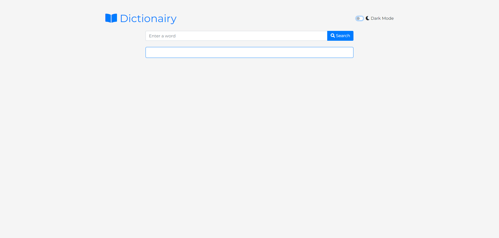
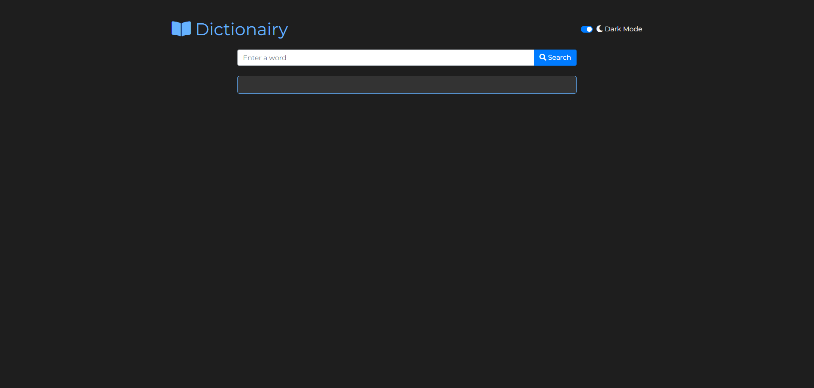

# Dictionary Web App


A responsive and interactive dictionary web app built with HTML, CSS (Bootstrap), and JavaScript. This app allows users to search for word definitions, hear pronunciations, and toggle between light and dark modes.

## Features

- **Word Search**: Enter a word and get its definition, pronunciation, and usage.
- **Pronunciation**: Hear the correct pronunciation of the word.
- **Dark Mode**: Toggle between light and dark modes for comfortable viewing.
- **Responsive Design**: Works on both desktop and mobile devices.
- **History**: Keeps track of your search history (coming soon).

## Demo

Check out the live demo [here](https://your-demo-link.com).

## Screenshots


*Light Mode*


*Dark Mode*

## Technologies Used

- **HTML**
- **CSS** (Bootstrap, FontAwesome)
- **JavaScript**
- **Free Dictionary API** (https://api.dictionaryapi.dev/)

## Installation

1. Clone the repository:
    ```sh
    git clone https://github.com/yourusername/dictionary-app.git
    cd dictionary-app
    ```

2. Open `index.html` in your browser:
    ```sh
    open index.html
    ```

## Usage

1. Enter a word in the search bar.
2. Press `Enter` or click the search button.
3. View the definition and pronunciation of the word.
4. Toggle the dark mode switch to change the theme.

## Customization

### CSS

To customize the appearance of the app, edit the `styles.css` file.

### HTML

To change the structure or content, edit the `index.html` file.

### JavaScript

To modify the functionality, edit the `app.js` file.

## Contributing

Contributions are welcome! Please fork the repository and create a pull request.

## License

This project is licensed under the MIT License - see the [LICENSE](LICENSE) file for details.

## Contact

For questions or feedback, please [email me](mailto:your.lucianclaudiu73@gmail.com).

---

*This project was created for learning and personal use. Feel free to use and modify it as per your needs.*
